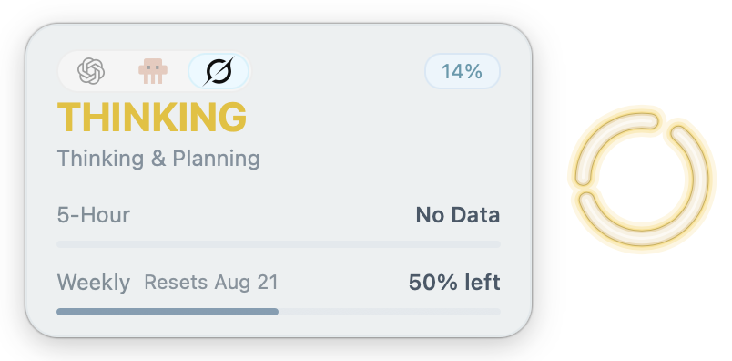

<a id="readme-top"></a>

<div align="center">
  
</div>

<h1 align="center">Agent Halo</h1>

<div align="center">
  <p>
    <a href="https://github.com/NePixe1/AgentHalo/releases/latest">
      
    </a>
    <a href="https://github.com/NePixe1/AgentHalo/releases">
      
    </a>
  </p>
  <p>
    
    
    
    
  </p>
  <p>Know when your coding agent is thinking, working, done, blocked, or waiting for you—without switching windows.</p>
  <p>English | <a href="README.zh-CN.md">Simplified Chinese</a></p>
</div>

---

## Features

- **Status at a glance.** One ambient ring distinguishes planning, tool execution, completion, requests for input, and blocking failures. A completed task keeps breathing until it is acknowledged.
- **Multiple agents, one focused signal.** Choose which agents appear from the tray menu; the current agent controls the ring and details. Windows actively polls only the current agent to reduce background overhead.
- **Useful detail on demand.** Hover to see official usage limits, context, or session details. Custom Codex / API-key sessions show project, model, and current-turn input/output tokens without exposing API keys, base URLs, or relay names—and without inventing official quota data.
- **A native desktop companion.** The always-on-top Windows and macOS apps need no browser or cloud dashboard. Drag and edge-snap the halo, resize it, pause monitoring, control startup, and recover it after a display change.
- **Local by design.** Lifecycle and session content stay on your machine. Official usage refreshes reuse an existing provider sign-in; Agent Halo does not require or read an OpenAI API key.

## Platform support

| Platform | Supported agents | Requirement |
| --- | --- | --- |
| Windows | Codex, Claude Code, Grok Build, Pi | Windows 10 or 11; .NET Framework 4.8 (usually preinstalled) |
| macOS | Codex, Claude Code, Grok Build, Pi; optional Antigravity (`agy`, default off) | macOS 13 or later |

Install and sign in to at least one supported agent before using Agent Halo.

## Install

Download the [latest GitHub release](https://github.com/NePixe1/AgentHalo/releases/latest).

### Windows

1. Download `AgentHalo-Windows-v*.zip`.
2. Extract the whole archive (do not run from inside the ZIP).
3. Double-click `AgentHalo.exe`. The halo appears near the upper-right of the primary display.

### macOS

1. Download `AgentHalo-macOS-*.dmg`.
2. Open the DMG and drag Agent Halo to Applications.
3. Launch it from Applications. Agent Halo is a menu bar app and does not show a Dock icon.

Official accounts do not need an OpenAI API key. When available, usage refresh reuses the provider login you already use.

## Quick usage

- **Drag** the halo to move it; it snaps lightly to screen edges.
- **Hover** for status and usage / session details; switch **Codex / CC / Grok / Pi** from the agent toggle.
- **Click** the halo to bring the Codex window forward when relevant.
- **Right-click** to choose **Monitored Agents** and the **Current Agent**, or access state previews, temporary pause, startup, always-on-top behavior, halo size (`75% / 100% / 125%`), **Reset Position**, and quit. At least one agent remains enabled; pause clears on the next launch.
- After a display change, an off-screen halo recovers to the primary display. On macOS, it can also return to its remembered display when that display reconnects.

## Status colors

| Color | Meaning |
| --- | --- |
| Amber (breathing) | Thinking / planning |
| Blue (breathing) | Running a command, search, edit, or tool |
| Green double flash → soft breath | Task finished and is waiting to be acknowledged |
| Purple double pulse | Waiting for approval, confirmation, or input |
| Red | A failure or interruption that blocked the task |
| Stable green | The focused agent is running with no active task |
| Dim white | No monitored activity |

## Privacy

- Lifecycle and session content stay **on your machine**; chat and session bodies are not uploaded.
- Agent Halo does **not** read or store OpenAI API keys, and never displays keys or private endpoint details.
- Optional usage checks use credentials you already signed in with and call official provider endpoints.
- For Codex usage refresh, OAuth tokens are not stored in Agent Halo's cache. Its usage snapshot contains only an account hash, percentages, and reset times.

Implementation-level paths, hooks, and cache layout are documented in [AGENTS.md](AGENTS.md).

## Troubleshooting

### Windows SmartScreen

Personal Windows builds are not commercially code-signed, so SmartScreen may warn. Only run archives from a source you trust, and confirm the hash in `SHA256.txt`:

```powershell
Get-FileHash .\AgentHalo.exe -Algorithm SHA256
```

The reported hash must exactly match the value in `SHA256.txt`.

### Duplicate Grok Build hooks on macOS

Grok Build may also load Claude Code hooks from `~/.claude/settings.json` (compatibility mode). That can make the same Agent Halo status hook appear twice in a Grok session (`agent-halo-status` and `settings`). Behavior stays correct; the extra run is only redundant.

To keep only the Grok-native path, set in `~/.grok/config.toml`:

```toml
[compat.claude]
hooks = false
```

This disables Claude hook import only (not skills, rules, MCP, or Claude Code itself). Restart the Grok session for the change to take effect. Any *other* hooks kept only in `~/.claude/settings.json` will also stop running under Grok.

## Build from source

Prefer a [GitHub release](https://github.com/NePixe1/AgentHalo/releases/latest) for everyday use. Build from source when you want the latest tree, a local change, or to verify a packaging path yourself.

Clone the repository first, then run the platform steps from the **repo root**.

### macOS

**Requirements:** macOS 13 or later, and Xcode or the Command Line Tools (so `swift` is available).

```bash
# Build, package, run checks, and launch
bash ./scripts/run-macos.sh --verify

# Package only (no launch)
bash ./scripts/build-macos.sh
```

- App bundle: `outputs/AgentHalo-macOS/AgentHalo.app`
- Optional DMG after a successful package build: `bash ./scripts/create-dmg.sh`

Quit a running local build with the menu bar item, or:

```bash
pkill -x AgentHaloMac
```

### Windows

**Requirements:** Windows 10 or 11, and .NET Framework 4.8 so the C# compiler exists at:

`%WINDIR%\Microsoft.NET\Framework64\v4.0.30319\csc.exe`

```powershell
.\scripts\build-windows.ps1
```

- Output: `outputs\AgentHalo\AgentHalo.exe`
- Optional self-test after build:

```powershell
.\outputs\AgentHalo\AgentHalo.exe --self-test $env:TEMP\agent-halo-self-test.txt
```

Unsigned personal builds may trigger SmartScreen; release archives ship `SHA256.txt` for verification.

## Contributing

Architecture, shared-contract changes, diagnostics, and contributor checks are documented in **[AGENTS.md](AGENTS.md)**.

## License

This project is licensed under the [MIT License](LICENSE).
