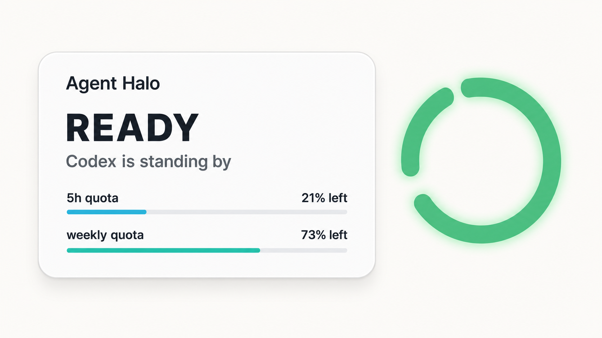

# Agent Halo



Codex 桌面端的本地常驻状态光环。

当前版本支持 Codex；后续计划加入 Claude Code（CC）状态识别。

版本：`0.10.2`（预发布）

[English](README.md) | 简体中文

---

## 系统要求

- Windows 10 或 Windows 11
- 已安装并使用 Codex 桌面端
- .NET Framework 4.8（目前的 Windows 10/11 通常已自带）

## macOS 开发版

运行并验证：

```bash
./script/build_and_run.sh --verify
```

应用是菜单栏辅助应用，不显示 Dock 图标。可以从菜单栏 Agent Halo 图标退出，也可以执行：

```bash
pkill -x AgentHaloMac
```

诊断命令：

```bash
cd mac
swift run AgentHaloDiagnostics --self-test /tmp/agent-halo-self-test.txt
swift run AgentHaloDiagnostics --render-states /tmp/agent-halo-states
swift run AgentHaloDiagnostics --transition-strip /tmp/agent-halo-transitions
```

## 安装与运行

1. 从 GitHub Releases 下载最新的 `AgentHalo-Windows-v*.zip`。
2. 解压整个 ZIP 压缩包，不要直接在压缩包内运行。
3. 双击 `AgentHalo.exe`，光环会出现在主显示器右上方附近。

程序没有安装器，不会修改 Codex，也不需要 OpenAI API Key。

## 操作

- 拖动光环：调整位置，靠近屏幕边缘时会自动吸附。
- 鼠标悬停：查看当前状态、5 小时额度和周额度。
- 任务完成后绿色会缓慢呼吸；再次打开 Codex 后自动确认并变为不发光的稳定绿色。
- 右键单击：打开状态预览、暂停监听、开机启动和退出菜单。
- 右键“光环大小”：选择 `75% / 100% / 125% / 150%`，重启后保持设置。
- 光环因拔掉副屏而消失时，从系统托盘右键选择“脱离卡死”，可移回主屏右上角。
- 双击：将 Codex 窗口切到前台。

## 状态含义

- 黄色长亮短暗：Codex 正在思考或规划。
- 蓝色长亮短暗：Codex 正在执行命令、搜索、编辑文件或调用工具。
- 绿色双闪：Codex 已完成；高亮两次后持续缓慢呼吸，直到你再次打开 Codex。
- 珊瑚橙双脉冲：Codex 正在等待 Yes、授权、确认或输入。
- 红色：仅表示阻止任务继续的故障；未查看时爆闪，打开 Codex 后常亮，离开后变为暗红。
- 稳定绿色：Codex 已运行且当前没有活动任务。
- 暗白色：Codex 未运行。

大断点会追赶缓慢往返漂移的小断点；接近约 40° 时，小断点会像受到磁斥一样
平滑推开到约 150°，随后带着逐渐衰减的惯性继续滑行并往返漂移。待机也会
持续运动，思考和执行状态转得更快。思考和执行期间，环条本体会从暗色材质
逐渐点亮：主体升为亮白灯芯，状态色保留在灯管边缘；窄光晕同步增强，中心透明。
思考、执行和完成状态采用连续的长亮短暗非对称呼吸，状态切换会先柔和收光，
在暗部完成颜色渐变，再自然点亮。磁斥时长和离场惯性
会根据当前实际转速自动调整，慢状态不会被突然拉走。
动画直接跟随桌面合成刷新频率，不再对待机或完成状态主动降帧。
“暂停状态监听”只在当前运行期间有效，重新启动后会自动恢复实时监听。
工具输出后蓝色会短暂保持约 1.8 秒，让快速工具调用也能清楚看见执行状态。

## 隐私

Agent Halo 只在本机读取 `%USERPROFILE%\.codex\sessions` 中的生命周期事件、
额度信息，以及 `logs_2.sqlite` 中结构化的连接和服务故障记录。SQLite 数据库仅以
只读方式查询。程序不会上传数据、调用网络服务、显示聊天内容，也不会读取或保存
OpenAI API Key。

## Windows 安全提示

这是一个未购买商业代码签名证书的自制程序，因此 Windows SmartScreen 可能提示
“Windows 已保护你的电脑”。请只在确认压缩包来自可信发送者、并核对
`SHA256.txt` 后运行。确认无误时，可选择“更多信息”查看程序名称。

可以在解压后的文件夹中打开 PowerShell，并执行：

```powershell
Get-FileHash .\AgentHalo.exe -Algorithm SHA256
```

输出的哈希值应与 `SHA256.txt` 中的值完全一致。

---

## 项目声明

Agent Halo 是独立的非官方开源项目，与 OpenAI、Quantic Dream 均无隶属或背书关系。
项目不包含游戏素材、名称、Logo 或照搬的指示灯几何造型。
